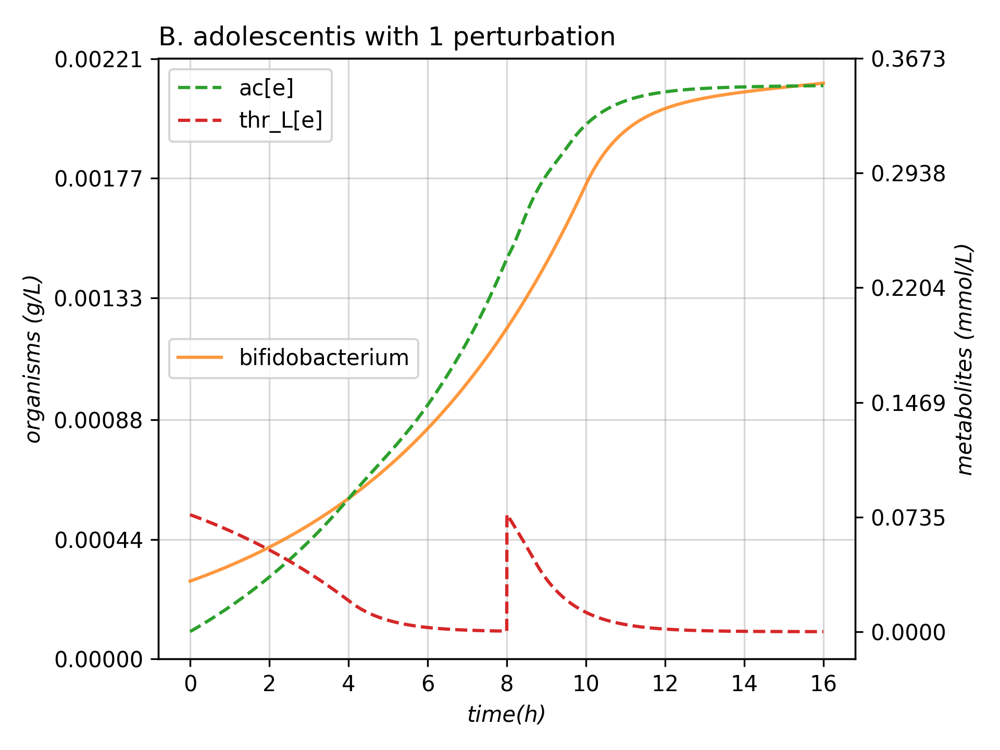

.. _expob:

The Experiment Object
=====================

The Experiment class provides a handy wrapper around the Consortium object with two key objectives:

 1. Store the state and perturbations occurred in a Consortium.
 2. Run sequences of dFBA + perturbations directly from configuration files.
 3. Automatic filtering of output files.

Using the package, we realized that a common operation was to initialize models
from a directory with random initial biomasses, instantiate medium and run a loop
that adds a perturbation and runs the simulation. That's exactly the objective
of this class.

Instantiating the Experiment
~~~~~~~~~~~~~~~~~~~~~~~~~~~~

Experiment is a subclass of Consortium and follows a similar initialization, adjusted
to read directly from files at the time of instantiating:

.. py:class:: Experiment(medium_path = "", models_dir = "", rand_biomasses = [0.0001,0.0005], perturbations = [], ..., lp = "fba", solver = "glpk")

  :param string medium_path: path to a JSON file containing medium and perturbations
  :param string models_dir: path to the directory where the models are read from
  :param list rand_biomasses: of two floats, upper and lower constraints to randomized initial biomasses (*default = [0.0001,0.0005]*)
  :param list perturbations: of names of the perturbations (*default = list of generic names*)
  :param string lp: establishing the type of LP problem (*default = "fba"*) to solve by the solver (*default = "glpk"*)
  :param ...: Rest of parameters of a :py:class:`Consortium`.

The JSON file where *medium_path* points must have the structure of a list of dictionaries.

.. code:: JavaScript

    [
      {
        Metabolite_of_media1 : amount,
        Metabolite_of_media2 : amount
        ...
      },
      {
        Metabolite_of_pertubation1 : amount,
        Metabolite_of_pertubation2 : amount
        ...
      },
      {
        Metabolite_another_pertubation1 : amount,
        Metabolite_another_pertubation2 : amount
      },
      ...
    ]

The *perturbations* parameters must have the same length of this JSON list. Either way,
a warning will be printed and, if needed, it will be filled with generic names.
On the other hand, the models on *models_dir* directory should have an *xml*,
*mat* or *json* extension. If a file in this directory isn't a model, a warning will be printed.

| An example can be performed from the MMODES root directory in the `GitHub repository <https://github.com/carrascomj/mmodes>`_.

.. code:: python3

    from mmodes import Experiment

    exp = Experiment(medium_path = "ModelsInput/media.json", models_dir = "ModelsInput",
                     perturbations = ['START', 'THR+TYR'],  mets_to_plot = ["ac[e]", "thr_L[e]"],
                     title = "B. adolescentis with 1 perturbation")

.. note::
   Don't get frightened by the walls of text in the screen. Each file is tried to be
   read by COBRAPy with different parsers and libSBML is really verbose right now.
   Sadly, it can't be filtered by now.

Running an Experiment
~~~~~~~~~~~~~~~~~~~~~
.. py:method:: Experiment.run_experiment(intervl = 10,,integrator = 'vode', stepChoiceLevel = (), verbose = False, outp = "models_dir.png", filter = False, equif = True, inplace_filter = False, plot = True, actualize_every = float(-inf))

   Starts a loop of community simulations + perturbations

   :param float intervl: time in simulation units (hours) between perturbations (*default = '10'*).
   :param str integrator: *('vode' 'dopri5' 'fea'  'rk4')* type of ODE integrator (*default = 'vode'*).
   :param str stepChoiceLevel: (0, max time step, max number of time-steps) for *vode* and (time-step, 0, max number of time-steps) for the rest of integrators (*default = 0., 0.5, 100*).
   :param bool verbose: a verbose simulation will show a progress bar, the reason of exiting the simulation and some messages of perturbations (*default = False*).
   :param string out: path where the output will be generated (*default= plot.tsv*).
   :param string outp: path where the plot will be generated (*default= "Some_Experiment.png"*).
   :param bool plot: whether to generate the plot (*default= True*).
   :param float actualize_every: time interval of writing to output files (*default = -inf*, write always)

The rest of parameters are discussed in the next section.

| Following the above example:

.. code:: python3

    #16 h of simulation
    exp.run_experiment(intervl = 8, integrator = 'fea', stepChoiceLevel = (0.005,0.5,10000))

It should have generated a tsv called *plot.tsv* and an image called *Some_Experiment.png*
like the one presented:

Filtering the output
~~~~~~~~~~~~~~~~~~~~

The 3rd objective of this class was to filter the output. But how exactly is filetered?
Briefly, the points right before each Perturbation in Medium output and fluxes are kept.
In addition, the fluxes can be filtered by keeping 100 equidistant points, generating
other file. We found that those kind of files were really useful for some applications.

| The parameters that control the filtering are in the :py:meth:`run_experiment`.

:param bool filter: whether output should be filtered (*default = False*)
:param bool equif: whether the equidistant flux output should be generated. It only works when *filter* is True (*default = True*).
:param bool inplace_filter: whether the original output should be overwritten by the filtered one (*default = False*)

.. note::
  The filtering functions currently support `datatable <https://github.com/h2oai/datatable>`_. If datatable, which is not
  a requiring for installing MMODES, isn't available, `pandas <http://pandas.pydata.org/>`_ will be used. With
  large outputs, using pandas might be quite slow.
